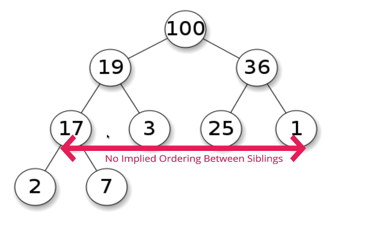

# [알고리즘] 이진 힙

기본적으로 힙은 트리이기 때문에, 트리에 적용되는 규칙들이 모두 적용된다.

## 이진 힙의 정의

힙은 트리의 일종으로, 이진 탐색 트리와도 매우 비슷하지만 다른 규칙을 갖고 있다. 그러나 이진 탐색 트리와는 다르게 왼쪽과 오른쪽에는 순서가 존재하지 않는다! 그냥 부모보다 작으면 된다.

## 이진 힙의 종류

### 최대 힙

-   부모 노드는 항상 자식 노드보다 큰 값을 갖는다.
-   왼, 오 상관없이 한 레벨 아래의 자식 노드보다는 항상 부모노드가 크다.
-   주의해야 할 점, 형제들 사이에는 특별한 순서가 존재하지 않는다.
    

즉, 이진 탐색 트리에서처럼 값의 순서를 알 수는 없는 것이다.

### 최소 힙

### 둘의 차이점 정리

## 실생활에서의 예시
